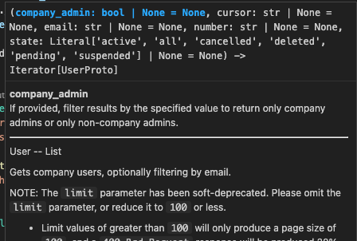
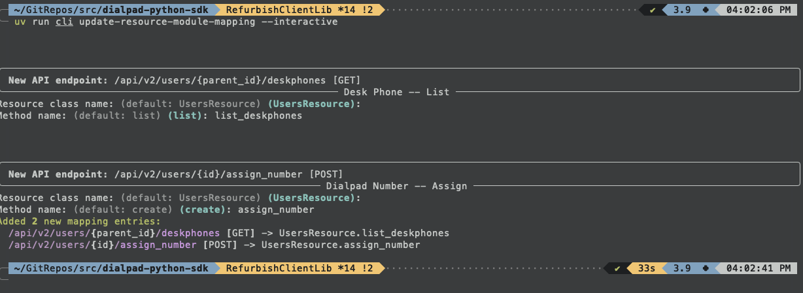

# Python Dialpad API Client

A python wrapper around the Dialpad REST API

This document describes the installation, usage, and development practices of this python library.
For information about the API itself, head on over to our
[API Documentation](https://developers.dialpad.com/reference) page!


## Installation

Just use everyone's new favourite python package manager: `uv`

```bash
uv add python-dialpad
```

## Usage

### The Short Version

TL;DR, this library provides a `DialpadClient` class, which can be instantiated with an API token
and a dialpad URL.

Once a `DialpadClient` object has been constructed, it can be used to call our API endpoints:

```python
from dialpad import DialpadClient

dp_client = DialpadClient(sandbox=True, token='API_TOKEN_HERE')

print(dp_client.users.get(user_id='1234567'))
```

### Client Constructor Arguments

- `token (required)` The API token that will be used to authenticate API requests.
- `sandbox (optional)` If the `sandbox` argument is set to `True`, then API calls will be
  routed to `https://sandbox.dialpad.com`.
- `base_url (optional)` Routes requests to a specific url.


### API Resources

In general, resources that we support in our public API will be exposed as properties of the
client object. For example, the `User` resource can be accessed using the `users` property (as
demonstrated above).

Each of these resource properties will expose related HTTP methods as methods of that resource
property.

For example, `GET /api/v2/users/{id}` translates to `dp_client.users.get('a_user_id')`.

When in doubt, type annotations and docstrings are sourced directly from the Dialpad API spec, and
should behave well with most editors' autocomplete/tooltip features:



### API Responses

In cases where our API responds with a single JSON object, the client method will return a Python
dict (as demonstrated above)

In cases where our API responds with a paginated list of many JSON objects, the client method will
return an iterator which will lazily request the next page as the iterator is iterated upon.

```python
from dialpad import DialpadClient

dp_client = DialpadClient(sandbox=True, token='API_TOKEN_HERE')

for user in dp_client.users.list():
  print(user)
```


## Development

This project is now managed with `uv`, and exposes a cli tool to automate most maintenance tasks.
`uv run cli --help` for details.


### Maintenance Releases

Changes/additions to the Dialpad API can be handled (mostly) automatically 👍

#### Update Procedure

- Overwrite `dialpad_api_spec.json` with the latest spec

- Run `uv run cli preprocess-spec`
  - This just does a few ham-fisted inplace edits to the spec file to make the schema paths a bit nicer

- Run `uv run cli update-resource-module-mapping --interactive`
  - This adds entries to `module_mapping.json` for any new API operations in the API spec.
    We (humans) get to decide the appropriate resource class and method name 👍



- Run `uv run cli generate-client`
  - This will regenerate all of the schema and resource files as per the API spec.

- Run `uv run pytest`
  - Never hurts to confirm that nothing got borked 👍

TODO: version bump, build, push, publish

